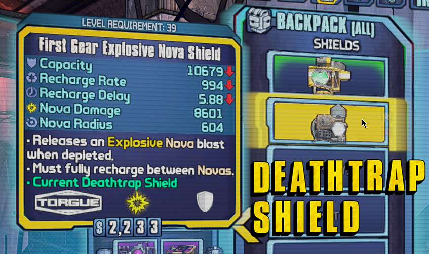
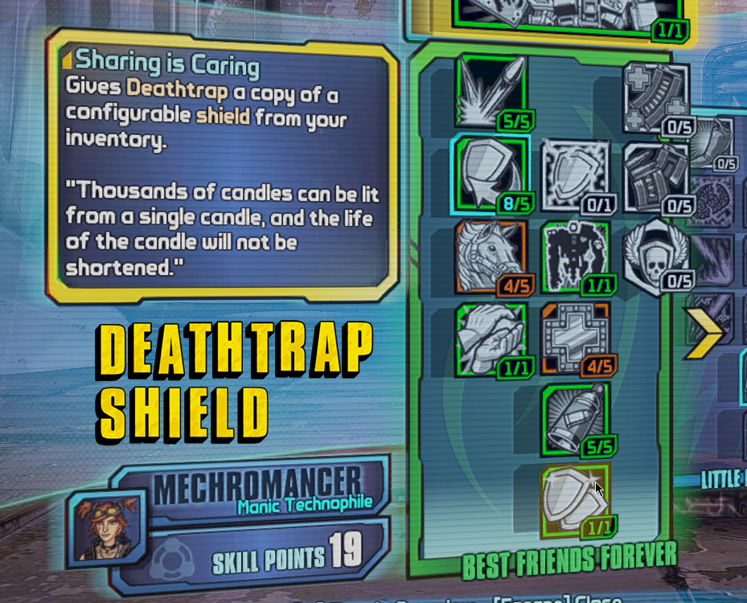
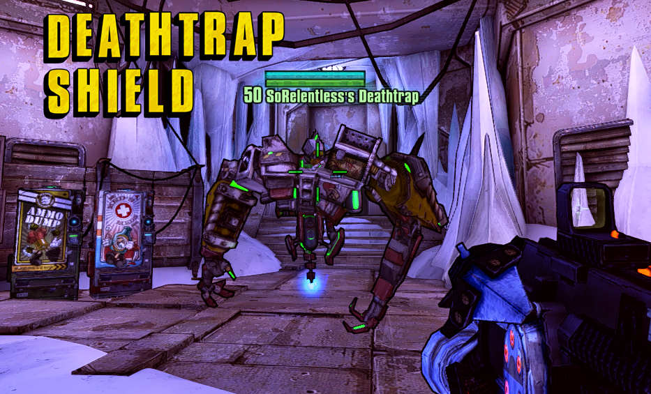

# **Deathtrap Shield** [![Workflow Status][workflow_status_badge]][workflow_status_link] [![Total Downloads][total_downloads_badge]][total_downloads_link] [![License][license_badge]][license] [![Code Style][black_badge]][black_link]

> A [PythonSDK] mod for [Borderlands 2][borderlands2] to give Deathtrap its own configurable shield from the inventory of Gaige.

- [Discord][discord]
- PythonSDK: `v0.7.9`
- Mod Menu: `v2.4`
- EridiumLib: `v0.4.1`

---

## **📎 Features**
- Deathtrap can use its own shield and no longer shares the shield with Gaige
- you can define which shield to use in the inventory
- configurable hotkey

    

        <strong>Preview (click to expand)</strong>
    

  
  

  
  

## **📑 Notes**
- this is a [PythonSDK] mod, you **can't** install it with BLCMM
- this mod needs the [EridiumLib] in order to run
- since this is often not the case with SDK mods: yes, this has multiplayer support
- the default behaviour of the skill applies and the shield of Gaige will be shared when:
  - you don't set a Deathtrap shield
  - you equip the Deathtrap shield to Gaige
- the Deathtrap shield will lose its status when:
  - you set a new Deathtrap shield while already having one
  - you equip the Deathtrap shield to Gaige
  - you throw the Deathtrap shield on the ground
  - another character that is not a Mechromancer puts it in their inventory
- you can't set shields as Deathtrap shield when:
  - the level of the shield is too high (if you can't equip it yourself)
  - you are not Mechromancer
- other useful information:
  - this only works if you unlocked the `Sharing is Caring` skill
  - you can only set one Deathtrap shield at a time
  - you can't set a Deathtrap shield as trash or favorite (unset it first)
  - the Deathtrap shield will have another color
- the hotkey to set the Deathtrap shield can be modified in the modded keybinds
- if you have a Deathtrap shield set, you won't be able to edit your save game in the SaveGame Editor unless you rejoin the game and remove the shield status, this can't be fixed

## **🔧 Installation**
1. download the latest **release** of this mod from [releases]
2. download the latest **release** of the EridiumLib from [here][eridiumlib_releases]
3. extract it to:
   - `Borderlands 2\Binaries\Win32\Mods`
4. activate the mod in the Mod Menu within the game

## **⏰ Changelog**
Everything related to versions and their release notes can be found in the [changelog].

## **🎓 License**
This project is licensed under the [GNU GPL v3.0][license].

<!-- Badges -->
[workflow_status_badge]: https://img.shields.io/github/workflow/status/RLNT/bl2_deathtrapshield/CI?style=flat-square
[workflow_status_link]: https://github.com/RLNT/bl2_deathtrapshield/actions/workflows/main.yml
[total_downloads_badge]: https://img.shields.io/github/downloads/RLNT/bl2_deathtrapshield/total?style=flat-square
[total_downloads_link]: https://github.com/RLNT/bl2_deathtrapshield/releases/latest
[license_badge]: https://img.shields.io/github/license/RLNT/bl2_deathtrapshield?style=flat-square
[black_badge]: https://img.shields.io/badge/code%20style-black-000000.svg?style=flat-square
[black_link]: https://github.com/psf/black

<!-- Links -->
[pythonsdk]: http://borderlandsmodding.com/sdk-mods/
[borderlands2]: https://store.steampowered.com/app/49520/Borderlands_2/
[discord]: https://discordapp.com/invite/Q3qxws6
[releases]: https://github.com/RLNT/bl2_deathtrapshield/releases
[eridiumlib]: https://github.com/RLNT/bl2_eridium
[eridiumlib_releases]: https://github.com/RLNT/bl2_eridium/releases
[changelog]: CHANGELOG.md
[license]: LICENSE
